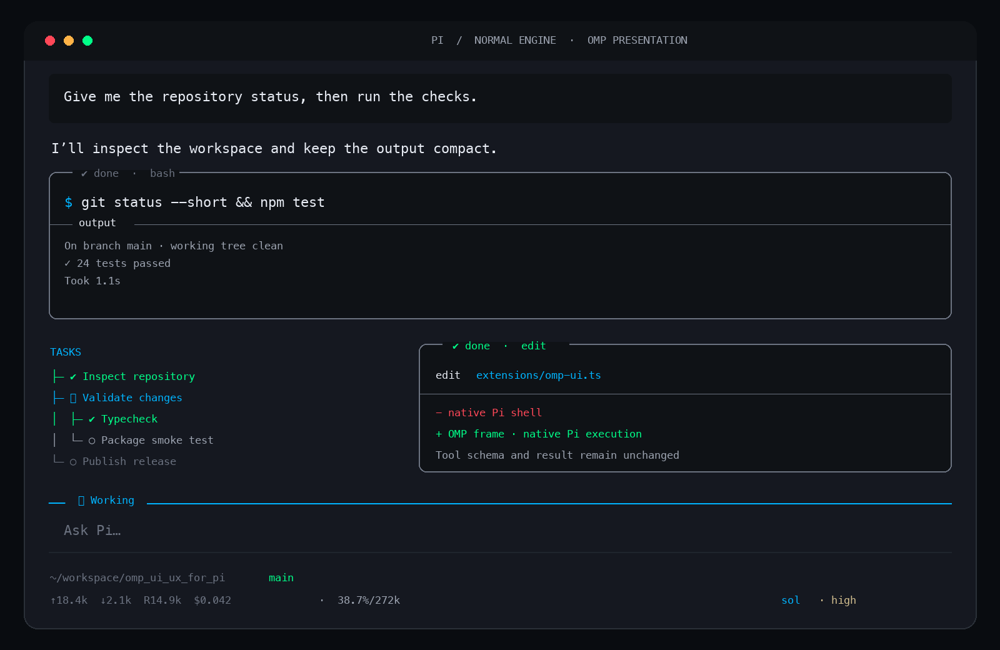

# pi-omp-ui

Oh My Pi-inspired presentation for **normal Pi**.



This package ports the visual layer only: the Titanium palette, compact tool frames, execution states, footer, composer treatment, and tree/list presentation. It does not install or run Oh My Pi. Pi remains the agent runtime.

## Install

Install globally for your Pi user:

```bash
pi install git:github.com/rebink/omp_ui_ux_for_pi
```

Restart Pi or run:

```text
/reload
```

Preview the components inside Pi:

```text
/omp-ui preview
```

Try it for one run without adding it to settings:

```bash
pi -e git:github.com/rebink/omp_ui_ux_for_pi
```

## Share with a team

From the project your team shares:

```bash
pi install git:github.com/rebink/omp_ui_ux_for_pi -l
git add .pi/settings.json
git commit -m "Add OMP UI for Pi"
```

After teammates trust the project, Pi installs the package declared in `.pi/settings.json` automatically.

## Update

```bash
pi update --extension git:github.com/rebink/omp_ui_ux_for_pi
```

Then run `/reload` inside Pi.

## Disable or remove

Use `pi config` to select another theme and disable either package resource. Then remove the global package with:

```bash
pi remove git:github.com/rebink/omp_ui_ux_for_pi
```

For a project-local installation, append `-l`.

## What changes

- OMP Titanium colors for messages, Markdown, code, diffs, and execution states
- Rounded, compact tool cards with running, success, warning, and error treatments
- Pi-native collapse, expansion, truncation, output capture, and mouse interaction
- Dense footer using Pi's existing path, branch, model, thinking, context, cache, token, cost, and extension-status data
- Compact multiline composer with embedded working status
- Reusable local tree/list component; no task-management tool or protocol

## What does not change

- Agent loop, providers, models, prompts, context, compaction, or token accounting
- Tool definitions, schemas, availability, arguments, execution, or results
- Skills, MCP, subagents, memory, browser, memory, LSP, or session behavior

The extension registers no LLM-callable tools and injects no messages or context. Estimated additional model-visible prompt and tool tokens: **0**.

## Compatibility

Developed and tested against Pi `0.85.1`. Pi currently has no renderer-only hook for built-in tools, so the extension decorates Pi's exported `ToolExecutionComponent` presentation methods. Image tools and third-party self-framed tools retain their native rendering.

## Development

```bash
git clone https://github.com/rebink/omp_ui_ux_for_pi.git
cd omp_ui_ux_for_pi
pi -e .
```

No build step or runtime dependency is required.

## Attribution

The palette and visual behavior were adapted from the current [Oh My Pi](https://github.com/can1357/oh-my-pi) UI. This independent project is not affiliated with or endorsed by Oh My Pi. See `NOTICE` and `LICENSE`.
